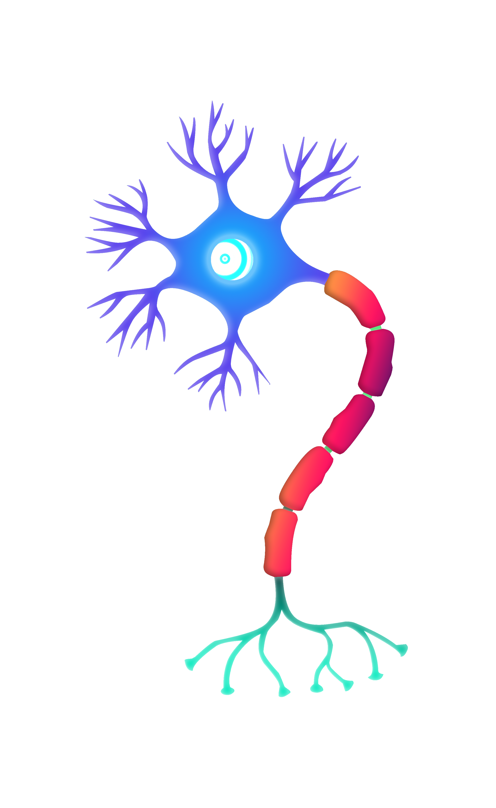
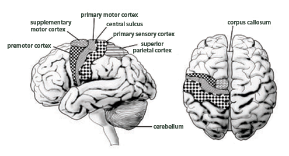
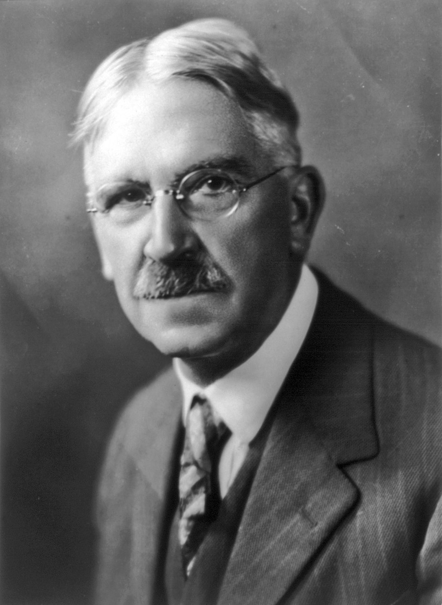
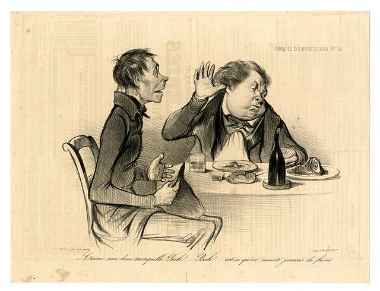
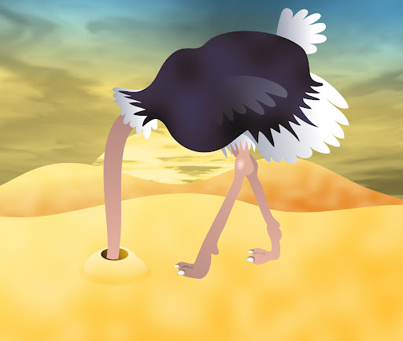
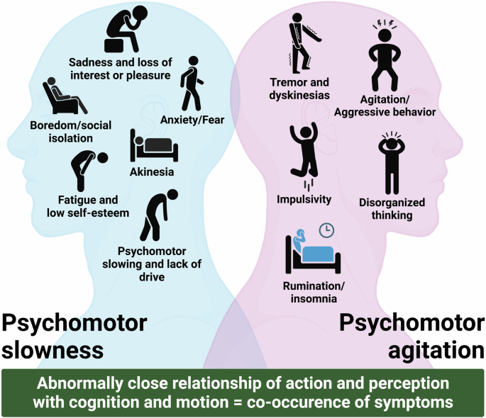
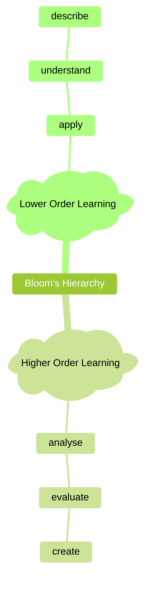
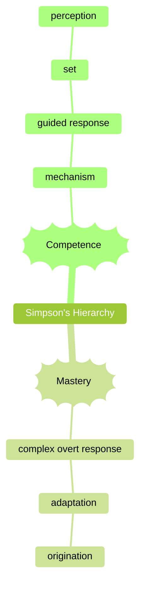
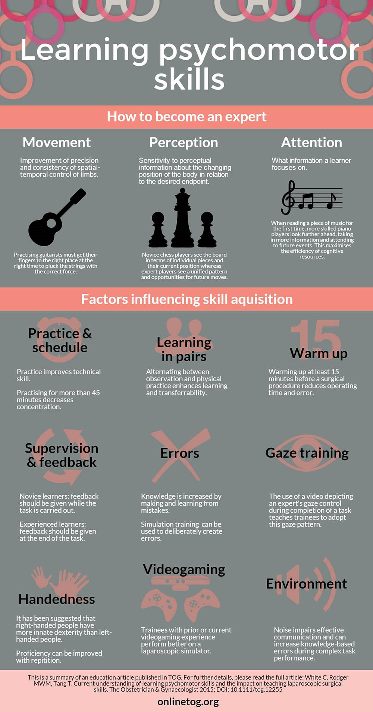

# Turning Smarts into Spectacular Stunts

## Pringles Cans

## How Do We Apply Scientific Thinking to Everyday Life?
|

| |

|||

I V

V

- We do not.

## Analysis Paralysis

Your brain has 100 billion neurons, about the same as the number of stars in our galaxy. 

That's a lot of mitochondria spending energy to help us think.

Our brain has different parts for different activities.

*Patton, MQ. (2014). What brain sciences reveal about integrating theory and practice. American Journal of Evaluation 35(2): 237-44.*

## Active Uncertainty

Thinking is "active uncertainty set over against conviction or unquestioning assurance." -- John Dewey

**Conviction**: judgement based on principles or values.

**Unquestioning assurance** : "everything is okay."

**Uncertainty** : "I am not sure."

**Active** : You know what this means.

## How Humans Deal with Complexity

How do you feel when you encounter something hard?

From the literature
- Satisfice (do enough to get it done)
- Heuristics (use rules of thumbs or mental shortcuts instead of diving deep)
- Overconfidence (with more information, we become more confident we can do something, except then we fail)
- Stick with what is familiar or available (representativeness and availability bias).

## Cognitive pain and getting things done

Moving from thinking to doing is hard work, and painful.

We need tools to manage "cognitive pain" so we can get work done.

Other times, we are overstimulated or anxious and need to slow our brain down.

## The other side of the coin

## Traditional Learning

## Psychomotor Learning

Elizabeth J. Simpson

## Skills in Psychomotor learning

## Who needs it?

- Empathy
- Define
- Ideation
- Prototype
- Testing

## Tips for becoming great at something

### Musical rhythm

"Converging research evidence indicates that musical rhythm is a powerful tool capable of modulating the activity of multiple brain networks and inducing neural plasticity, with great potential for supporting or recovering motor functioning."

[*Thenille, BJ, Yuko, K, Richard, NM, and Thaut, MH. (2021). Rhythm and music-based interventions in motor rehabilitation: current evidence and future perspectives. Frontiers in Human Neuroscience 15.*](https://www.frontiersin.org/journals/human-neuroscience/articles/10.3389/fnhum.2021.789467)

- it engages the temporal lobe, which is closer to the motor processes in the frontal lobe than vision (occupital lobe) or perception.

### Dealing with Cognitive Pain

**endorphins** are natural chemicals in the body that get released when your body feels pain or stress.

Thinking and learning is a painful and frustrating activity. Use the natural pain killers to help you overcome the "pain" barrier that prevents turning thinking into doing.

- Go for a walk. Especially, talk over the assignment with a friend.
- Any exercise works.
- Massage while you do homework.
- Swearing or fake swearing ("suffering succotash!"). Swear words usually have plosives or fricatives, which have an endorphin releasing effect.
- Laughing.
- Sun!
- Music (again), especially if you can play it yourself.
- Rapping.

### Avoiding Shortcuts

- Speak the hard part out loud.
- Write down what is correct and incorrect about your inner thoughts or first impressions. Use the correct and incorrect parts to identify a course of actions. 
- Use procedural short-cuts to help you move forward.
- Draw pictures of what you would like to happen.

### Things that determine whether you will act

- It seems useful to you.
- The thing you are considering is both important and pressing.
- You can easily know the options for action.
- The actions you can take are appropriate for the situation.
- Virtue. You are or intend to be a person who is willing to act.

*Chelimsky, E. (1997). The coming transformations in evaluation. In E. Chelimsky & W. Shadish (Eds). Evaluation for the 21st Century (pp. 1-26). Thousand Oaks, CA: Sage.*

## Summary

Thinking is very much like exercise.